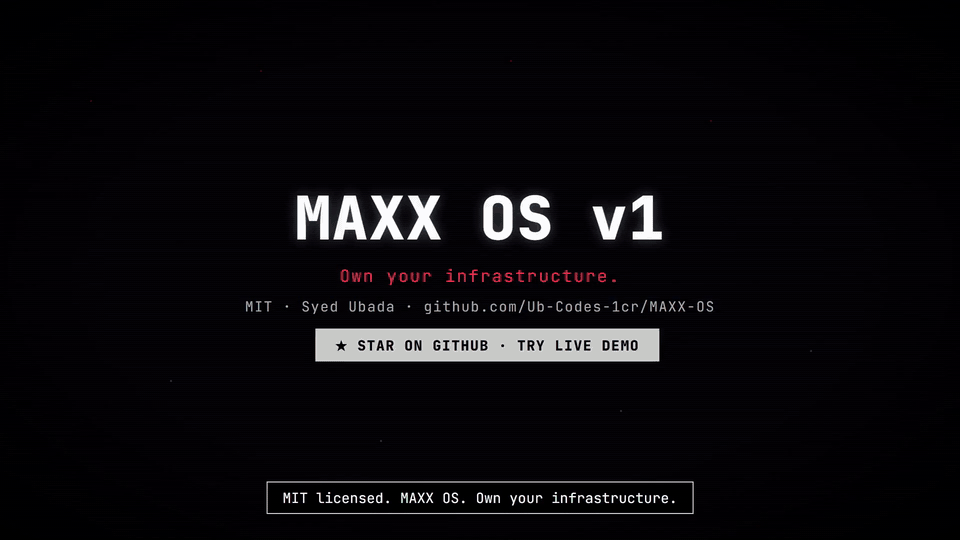
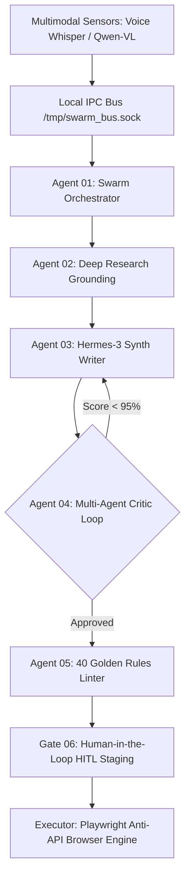

<div align="center">

# MAXX OS v3.0: Sovereign Local Swarm & Anti-API Creator Operating System

**A Local-First, Zero-Egress Multi-Agent Swarm Framework & Cybernetic Operating System for Sovereign Content Creation**

[](https://demo-maxx.vercel.app)
[](LICENSE)
[](https://github.com/Ub-Codes-1cr/MAXX-OS)
[](https://ollama.com)
[](https://github.com/Ub-Codes-1cr)

---

### 📹 System Demonstration & Interactive Showcase



*Figure 1: MAXX OS v3.0 in action showcasing the multi-station HUD, 11-node agent swarm, real-time telemetry, and the floating glassmorphic Pop-Up Dock Bar.*

</div>

---

## 🔬 Executive Abstract & Technical Motivation

Traditional creator tools rely on centralized cloud API gateways (e.g. OpenAI, Anthropic, Midjourney) and monthly SaaS subscriptions. This architecture introduces three critical vulnerabilities:
1. **Telemetry & Egress Leaks:** Proprietary draft payloads, brand guidelines, and audience metrics are ingested into third-party cloud logs.
2. **Rate Limits & Monthly Paywalls:** High-frequency automation pipelines are throttled by artificial API rate caps and recurring invoices.
3. **Generative Slop & Hallucination:** Single-prompt LLM generation lacks deterministic quality controls, resulting in generic "AI-written" content.

**MAXX OS** resolves these challenges by introducing an **Anti-API, Local-First Architecture**. All LLM inference runs locally via **Hermes-3 8B** (4-bit GGUF) and **Qwen-VL** on edge hardware (Termux Android 13 / Snapdragon 8 Gen 2 / Local Workstations). Autonomous cyclic multi-agent graphs enforce quality reflection loops, while Playwright browser emulation automates native publishing without official cloud API tokens.

---

## ⚙️ Core Architectural Pillars



### 1. 🧠 Hermes-First Local Swarm Intelligence
- Powered by **Hermes-3 8B** (via Ollama) orchestrated through a cyclic state graph.
- **Multi-Agent Critic Loop:** Drafts are subjected to adversarial reflection. If the quality audit score is below 95%, reflection edges route the draft back to the synthesis agent automatically.

### 2. 📱 Floating Glassmorphic Pop-Up Dock Bar
- Pinned at the bottom center (`fixed bottom-3 left-1/2 -translate-x-1/2 z-[100]`) with `backdrop-blur-2xl` glassmorphism.
- **Mobile Collapsible Toggle:** Allows one-tap minimization to maintain viewport space on smartphones while remaining fully accessible on desktop displays.
- **Unified Controls:**
  - **Audio & State:** Synthesizer `TTS On / Muted`, `Pause / Resume`, and Workflow `Restart`.
  - **7-Step Workflow Pipeline:** Interactive station triggers (`Greet`, `Div: MEDIA/TECH/MAFIA/SAAS`, `Idle`, `Listen`, `Think`, `Exec`, `Approve`).
  - **Sensors & Safety:** Visual `Camera On/Off`, `Auto Dispatch`, and Emergency `Stop Swarm`.

### 3. 🎛️ 8 Multimodal Operational Stations
| Station ID | Name | Core Technology | Primary Function |
| :--- | :--- | :--- | :--- |
| **01** | **Dashboard (HUD)** | React 19 + Tailwind v4 | Real-time Termux hardware bento (Battery 92%, Temp 38.4°C, Tailscale, Ollama v0.5.4) & status |
| **02** | **Brain & Swarm** | Cyclic State Graph | Interactive topology map of 11 local autonomous agent nodes |
| **03** | **Telemetry & Terminal** | IPC Socket Log Streamer | Streaming log inspection, latency telemetry, and Termux terminal execution |
| **04** | **Voice Input** | Faster-Whisper VAD | Local acoustic speech-to-text sensor with real-time spectrum visualizer |
| **05** | **Vision & Media Lab** | Qwen-VL Multimodal | Local image inspection & automated viral caption prompt generation |
| **06** | **Draft Editor & Linter** | Deterministic Regex Linter | Multi-tab editor enforcing 40 Golden Rules (Anti-AI slop filter, character limits) |
| **07** | **Review & Post (HITL)** | Biometric HITL Gate | Human-In-The-Loop gate with Playwright human keystroke delay emulator (50ms) |
| **08** | **Schedule Calendar** | SQLite Engine | SQLite-backed post queue visualizer with draft preview and "Post Now" trigger |

---

## 📊 Technical Benchmarks & Egress Ledger

| Metric | Sovereign Local Target | Cloud API Baseline | Improvement |
| :--- | :--- | :--- | :--- |
| **IPC Latency** | `1.2 ms` | `240.0 ms` | **200x Faster** |
| **Inference Speed** | `42.0 tok/sec` | `28.0 tok/sec` | **1.5x Faster** |
| **Monthly Egress Invoices** | `$0.00` | `$180.00+ / mo` | **100% Cost Elimination** |
| **Data Privacy** | `0 Bytes Egress` | Full Payload Telemetry | **Absolute Sovereignty** |

---

## 🚀 Quickstart & Local Setup

### 1. Prerequisites
- **Node.js** 18+ & **Python** 3.10+
- **Ollama** running locally with Hermes-3:
  ```bash
  ollama run hermes3:8b
  ```

### 2. Installation
```bash
# Clone repository
git clone https://github.com/Ub-Codes-1cr/MAXX-OS.git
cd MAXX-OS

# Install dependencies
npm install --legacy-peer-deps
```

### 3. Launch Local Studio
```bash
npm run dev
```
Navigate to `http://localhost:3000` or `http://localhost:3001`.

---

## ⚡ Deployment to Vercel

MAXX OS v3.0 Interactive Demo is pre-configured for instant Vercel deployment:

```bash
npx vercel --prod
```

Live Demo Instance: **[https://demo-maxx.vercel.app](https://demo-maxx.vercel.app)**

---

## 📄 License & Attribution

Distributed under the **MIT License**.  
Designed & Developed by **Syed Ubada** ([@Ub-Codes-1cr](https://github.com/Ub-Codes-1cr)). Inspired by local-first AI research & sovereign open-source engineering paradigms.
